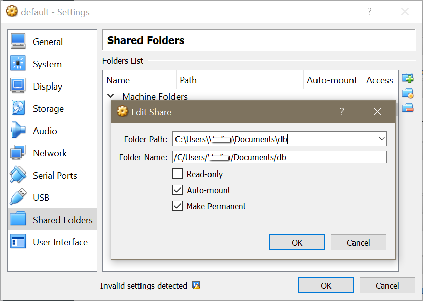

### Set hosts 

Add new entry to `C:\Windows\System32\drivers\etc\hosts`:

`192.168.99.100 budgets-app.dev`

Move production/stage databases to `C/Users/<user>/Documents/db`

### Windows Home

For Windows Home use Docker Toolbox

For app set host to 0.0.0.0 (not 127.0.0.1)

In order to use mounted folders with Docker Toolbox add entry to Virtual Machine's Shared folders

## Containers

`docker build -t ba-identity:latest .`

`docker run -p 5011:8080 -v /C/Users/<user>/Documents/db:/usr/db ba-identity`